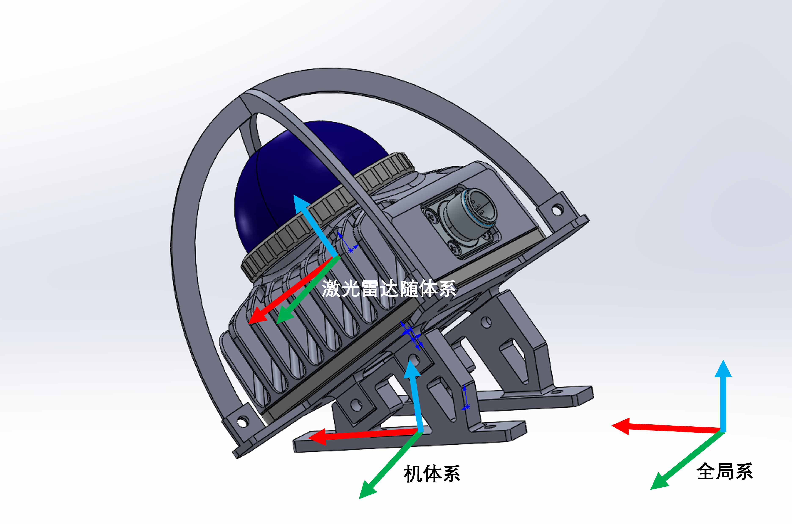
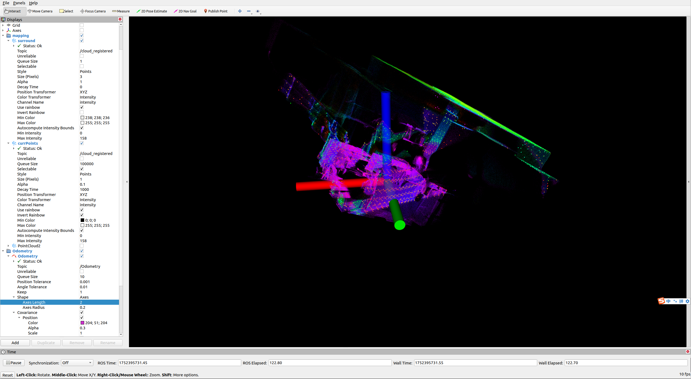
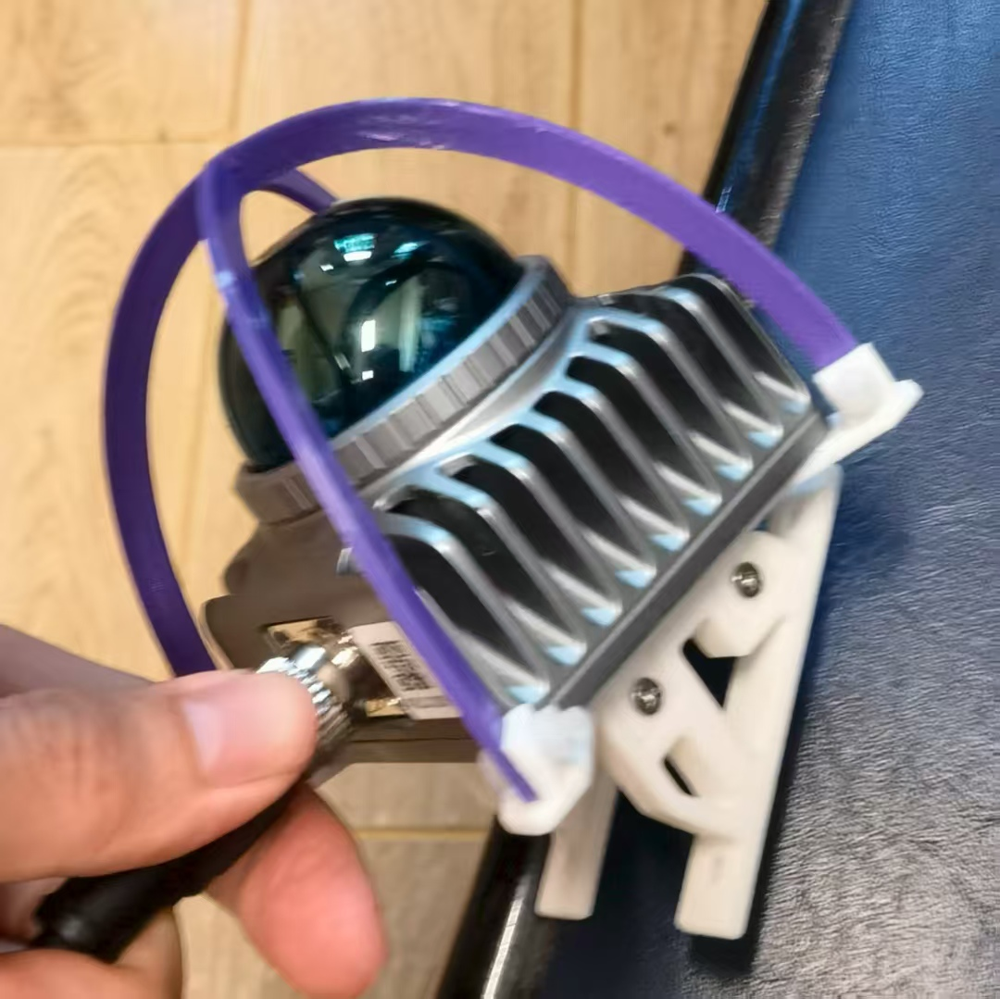
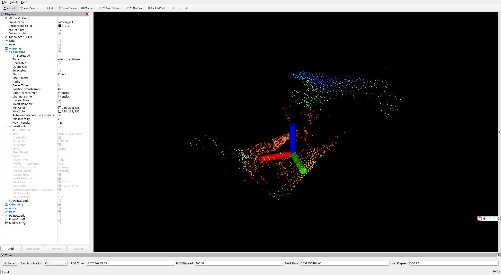
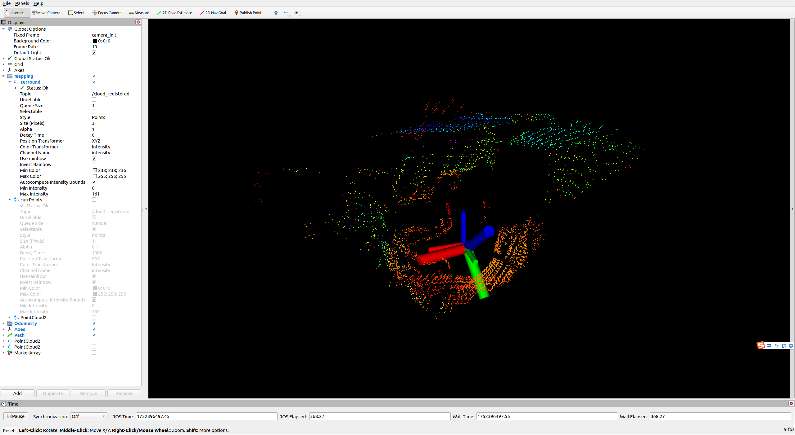
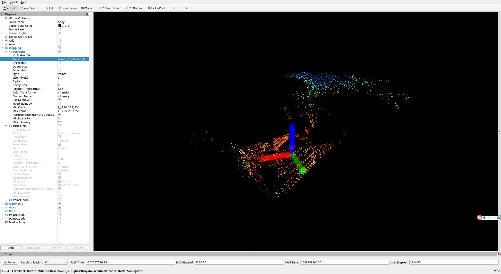

本文档主要针对，倾斜安装mid360时，livox、fastlio和飞机等坐标系的问题进行说明

# 坐标系定义

激光雷达随体系、机体系、全局系



# fastlio的坐标系

fastlio的坐标系，一切以输入的imu坐标系为准，且输入的lidar要与之匹配，其topic位于

> src/FAST_LIO/config/mid360.yaml

```yaml
    lid_topic:  "/livox/lidar"
    imu_topic:  "/livox/imu"
```

如果二者不匹配，则需动用位于进行旋转匹配

> src/FAST_LIO/config/mid360.yaml

```yaml
    extrinsic_R: [ 0.866, 0, 0.5,
                   0, 1, 0,
                   -0.5, 0, 0.866]
```

此时是安装为俯仰角30度低头

/cloud_registered对应全局坐标系下的点云，对应rviz里面的camera_init，运行fastlio的起始值，后面不再移动

/cloud_registered_body对应输入的imu坐标系下点云，对应rviz里面的body


以几个例子来说明

## 使用未修改的/livox/lidar和/livox/imu

此时二者坐标系匹配，均处于激光雷达随体系，extrinsic_R为单位阵，无需修改

```bash
gnome-terminal -x bash -c "source $HOME/livox_ws/devel/setup.bash;roslaunch livox_ros_driver2 msg_MID360.launch; exec bash"

gnome-terminal --tab  -t "FastLio" -- bash -c "source $HOME/fast_lio_ws/devel/setup.bash; roslaunch fast_lio mapping_mid360.launch rviz:=true; exec bash;"
```

此时rviz选取camera_init，则可以清晰看到/cloud_registered，其点云是斜的，晃动雷达点云位置不动




注意，此时我是沿机体系滚转激光雷达，也就是卡着雷达安装支架进行倾斜



观察第二张rviz图，发现其并不按照单纯绕x轴（红色）转动，这是因为fastlio以输入的imu坐标系为基准输出姿态角，此时基准位于/livox/imu的激光雷达随体系下，二者相差俯仰30度，所以不一致


另外注意，此时输出的/cloud_registered_body是在输入的imu坐标系下，即激光雷达随体系

<font color='red' size = 6>此时不能直接将fastlio输出的/Odometry和/cloud_registered_body用于探索程序，因为/Odometry在激光雷达随体系下，不是飞机机体系下的姿态角 </font>

## 使用机体系下的imu和/livox/lidar

此时，向fastlio输入机体系下的imu，可以来自mavros消息，也可以来自后文修改livox驱动

此时，/livox/lidar（激光雷达系）和imu（机体系）并不处于同一坐标系，二者相差俯仰三十度

故修改

```yaml
    extrinsic_R: [ 0.866, 0, 0.5,
                   0, 1, 0,
                   -0.5, 0, 0.866]
```

此时rviz选取camera_init，则可以清晰看到/cloud_registered，其点云是正的，晃动雷达点云位置不动





仍然沿机体系滚转激光雷达，也就是卡着雷达安装支架进行倾斜，观察第二张rviz图，发现其单纯绕x轴（红色）转动，这是因为fastlio以输入的imu坐标系为基准输出姿态角，此时基准位于机体系下，二者一致

另外注意，此时输出的/cloud_registered_body是在输入的imu坐标系下，即机体系下。将rviz选择为body系下，平放雷达支架点云/cloud_registered_body也是平的，因为此时body系就是机体系，看天花板就是平的


## <font color='red' size = 6>此时不能直接输入/cloud_registered_body给探索程序，因为其需要的是激光雷达坐标系点云！需要额外转换</font>


# 可行的解决方案

1. 使用机体系下的imu（例如mavros中的）和/livox/lidar给fastlio，输入探索程序/cloud_registered_body和/Odometry，在探索程序中反向转换

   ```yaml
       extrinsic_R: [ 0.866, 0, 0.5,
                      0, 1, 0,
                      -0.5, 0, 0.866]
   ```

   

2. 使用机体系下的imu（例如mavros中的）和/livox/lidar给fastlio，输入探索程序/livox/lidar_pcl和/Odometry，此时二者同步性差


# 代码层面修改

## livox驱动转换imu坐标系到机体系下

livox驱动正常输出的imu是在激光雷达的随体系下，现在引入换算程序

发布imu数据位于，对其进行修改

>src/livox_ros_driver2/src/lddc.cpp

```C++
void Lddc::PublishImuData(LidarImuDataQueue& imu_data_queue, const uint8_t index) {
  ImuData imu_data;
  if (!imu_data_queue.Pop(imu_data)) {
    //printf("Publish imu data failed, imu data queue pop failed.\n");
    return;
  }

  ImuData imu_data_rotate;
  imu_data_rotate.lidar_type = imu_data.lidar_type;
  imu_data_rotate.handle = imu_data.handle;
  imu_data_rotate.slot = imu_data.slot;
  imu_data_rotate.time_stamp = imu_data.time_stamp;


  Eigen::Vector3d acc_raw(imu_data.acc_x, imu_data.acc_y, imu_data.acc_z);
  Eigen::Vector3d gyro_raw(imu_data.gyro_x, imu_data.gyro_y, imu_data.gyro_z);

  Eigen::Vector3d acc_rot = rotation_matrix_ * acc_raw;//rotation_matrix_作为成员变量，记录要转换的矩阵
  Eigen::Vector3d gyro_rot = rotation_matrix_ * gyro_raw;

  ROS_INFO("acc_raw: %f, %f, %f", acc_raw.x(), acc_raw.y(), acc_raw.z());
  ROS_INFO("gyro_raw: %f, %f, %f", gyro_raw.x(), gyro_raw.y(), gyro_raw.z());
  ROS_INFO("acc_rot: %f, %f, %f", acc_rot.x(), acc_rot.y(), acc_rot.z());
  ROS_INFO("gyro_rot: %f, %f, %f", gyro_rot.x(), gyro_rot.y(), gyro_rot.z());

  imu_data_rotate.acc_x = acc_rot.x();
  imu_data_rotate.acc_y = acc_rot.y();
  imu_data_rotate.acc_z = acc_rot.z();
  imu_data_rotate.gyro_x = gyro_rot.x();
  imu_data_rotate.gyro_y = gyro_rot.y();
  imu_data_rotate.gyro_z = gyro_rot.z();

  ImuMsg imu_msg;
  uint64_t timestamp;
  InitImuMsg(imu_data_rotate, imu_msg, timestamp);

  // ImuMsg imu_msg;
  // uint64_t timestamp;
  // InitImuMsg(imu_data, imu_msg, timestamp);


#ifdef BUILDING_ROS1
  PublisherPtr publisher_ptr = GetCurrentImuPublisher(index);
#elif defined BUILDING_ROS2
  Publisher<ImuMsg>::SharedPtr publisher_ptr = std::dynamic_pointer_cast<Publisher<ImuMsg>>(GetCurrentImuPublisher(index));
#endif

  if (kOutputToRos == output_type_) {
    publisher_ptr->publish(imu_msg);
  } else {
#ifdef BUILDING_ROS1
    if (bag_ && enable_imu_bag_) {
      bag_->write(publisher_ptr->getTopic(), ros::Time(timestamp / 1000000000.0), imu_msg);
    }
#endif
  }
}
```


> src/livox_ros_driver2/src/lddc.cpp

修改类初始化函数，使其可以传输rotation_matrix

```C++
Lddc::Lddc(int format, int multi_topic, int data_src, int output_type,
    double frq, std::string &frame_id, bool lidar_bag, bool imu_bag, Eigen::Matrix3d rotation_matrix)
    : transfer_format_(format),
      use_multi_topic_(multi_topic),
      data_src_(data_src),
      output_type_(output_type),
      publish_frq_(frq),
      frame_id_(frame_id),
      enable_lidar_bag_(lidar_bag),
      enable_imu_bag_(imu_bag) ,
      rotation_matrix_(rotation_matrix)
```

并加入成员变量

> src/livox_ros_driver2/src/lddc.h

```c++
Eigen::Matrix3d rotation_matrix_;
```

在外层引入参数，使其可以正确计算旋转矩阵

> src/livox_ros_driver2/launch_ROS1/msg_MID360.launch

```yaml
	<param name="pitch" type="double" value="30"/>
	<param name="roll" type="double" value="0"/>
	<param name="yaw" type="double" value="0"/>
```

> src/livox_ros_driver2/src/livox_ros_driver2.cpp

```c++
#include <Eigen/Dense>

int main(int argc, char **argv) {
//...加入
  double pitch = 0;
  double roll = 0;
  double yaw = 0;
  
  livox_node.GetNode().getParam("pitch",pitch);//度为单位
  livox_node.GetNode().getParam("roll",roll);
  livox_node.GetNode().getParam("yaw",yaw);

  pitch *= M_PI/180.0;
  roll *= M_PI/180.0;
  yaw *= M_PI/180.0;

  // 欧拉角 (Z-Y-X 顺序：偏航 yaw, 俯仰 pitch, 横滚 roll)
  Eigen::Vector3d euler_angles(yaw, pitch, roll); // 单位为弧度

  // 创建 ZYX 顺序的旋转矩阵
  Eigen::Quaterniond q = 
  Eigen::AngleAxisd(euler_angles[0], Eigen::Vector3d::UnitZ()) *  // Z 轴旋转 (yaw)
  Eigen::AngleAxisd(euler_angles[1], Eigen::Vector3d::UnitY()) *  // Y 轴旋转 (pitch)
  Eigen::AngleAxisd(euler_angles[2], Eigen::Vector3d::UnitX());   // X 轴旋转 (roll)

  Eigen::Matrix3d rotation_matrix = q.toRotationMatrix();  
//...修改
  livox_node.lddc_ptr_ = std::make_unique<Lddc>(xfer_format, multi_topic, data_src, output_type,
                        publish_freq, frame_id, lidar_bag, imu_bag, rotation_matrix);    

}
```

此时可以读取yaml文件中的安装角，传入lddc中

## 运行msg_MID360.launch时额外发布一个PCL2点云

>src/livox_ros_driver2/src/lddc.cpp

```c++
void Lddc::PublishCustomPointcloud(LidarDataQueue *queue, uint8_t index) {
  while(!QueueIsEmpty(queue)) {
    StoragePacket pkg;
    QueuePop(queue, &pkg);
    if (pkg.points.empty()) {
      printf("Publish custom point cloud failed, the pkg points is empty.\n");
      continue;
    }

    CustomMsg livox_msg;
    InitCustomMsg(livox_msg, pkg, index);
    FillPointsToCustomMsg(livox_msg, pkg);
    PublishCustomPointData(livox_msg, index);
	//加入以下几行
    PointCloud2 cloud;
    uint64_t timestamp = 0;
    InitPointcloud2Msg(pkg, cloud, timestamp);
    cloud.header.frame_id = "map";//指定frame，不然默认是livox_frame
    PublishPointcloud2Data2(index, timestamp, cloud);
  }
}
//加入以下函数，头文件也要添加
void Lddc::PublishPointcloud2Data2(const uint8_t index, const uint64_t timestamp, const PointCloud2& cloud) {
#ifdef BUILDING_ROS1

  ros::Publisher *pub = nullptr;
  pub = new ros::Publisher;
  char name_str[48];
  snprintf(name_str, 48, "livox/lidar_pcl");

  *pub = cur_node_->GetNode().advertise<sensor_msgs::PointCloud2>(name_str, 8);


#elif defined BUILDING_ROS2
  Publisher<PointCloud2>::SharedPtr publisher_ptr =
    std::dynamic_pointer_cast<Publisher<PointCloud2>>(GetCurrentPublisher(index));
#endif

  if (kOutputToRos == output_type_) {
    pub->publish(cloud);
  } else {
#ifdef BUILDING_ROS1
    if (bag_ && enable_lidar_bag_) {
      bag_->write(pub->getTopic(), ros::Time(timestamp / 1000000000.0), cloud);
    }
#endif
  }
}
```

## fast_lio同步回调的问题

fast_lio中时间戳很奇怪，是

```c++
laserCloudmsg.header.stamp = ros::Time().fromSec(lidar_end_time);
```

所以他不能和其他东西一起回调，不同步

全局搜索ros::Time().fromSec(lidar_end_time)，改为

```c++
= ros::Time::now()
```

